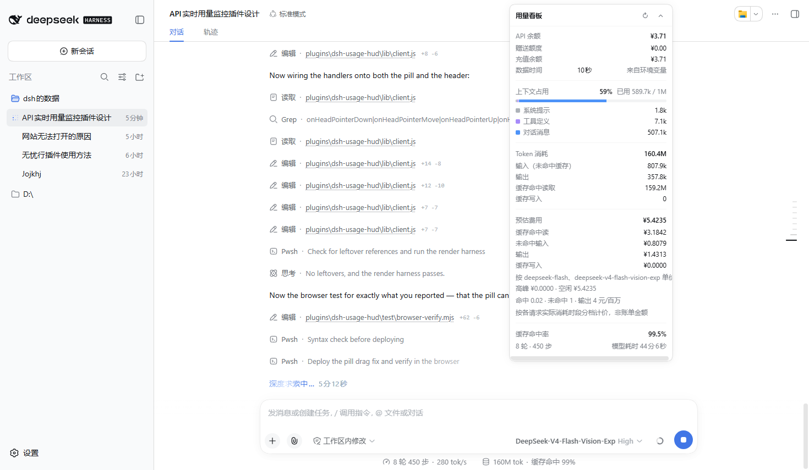

# dsh-usage-hud

一个 DSH（DeepSeek Harness）网页版插件：一块悬浮面板，实时显示这次会话正在花掉你多少钱。



| 显示项 | 含义 | 来源 |
|---|---|---|
| **API 余额** | 账户余额、币种、赠送额度与充值余额的拆分 | host 路由 `GET /api/usage-hud/balance` → 上游 `/user/balance` |
| **预估费用** | 本次会话的 token 折算成人民币多少，按 token 桶**并按时段**拆分 | host 的 `usageCost` 会话投影 |
| **缓存命中率** | `缓存命中读 /（命中读 + 未命中输入 + 缓存写入）`，整份日志口径 | `tokenUsage` 会话投影 |
| **上下文占用** | 已用 / 窗口，外加各部分构成的条形图 | `contextPressure` + `contextBreakdown` 投影 |
| **Token 消耗** | 未命中输入、输出、缓存命中读、缓存写入，以及合计 | `tokenUsage` 会话投影 |
| 轮次 / 步骤 / 模型耗时 | 会话规模与模型墙上时间 | `sessionStats` 会话投影 |

面板开在**右上角**，浮在应用自身界面之上。位置和收起状态都存在 `localStorage` 的 `dsh.usage-hud.v1` 下。

**两种拖法。** 展开时拖标题栏——标题栏上自己的按钮仍然照常可点。收起成小药丸时，药丸本身就是拖柄，于是一个手势干两件事：按下后移动超过几个像素就是挪位置，原地松开就是展开。两者靠指针位移量区分，所以拖拽结束时绝不会顺手把面板开合掉。

位置约束是相对于视口、而不只是相对于偏移量的：只约束存储的偏移量，会让一个很高的面板在往上拖时把顶边拖出屏幕，拖柄跟着跑到够不着的地方，面板就再也拉不回来了。现在的约束用实测尺寸，四条边都留在窗口内，并在窗口尺寸变化、展开/收起、以及面板自身高度变化（`ResizeObserver`）时重新施加。它是约束不是锁——往回拖照样能动。

费用数字统一保留四位小数，总计和各项一样，所以拆分明细看起来就是能加回总价的，不会因为两位小数四舍五入而差一分钱。

## 安装

插件不是下载即用：它得装进 dsh 的 profile 才有用。下面的方法都只需要一条命令，装完**不用重启 dsh**，刷新一下网页就出现看板。

### 一条命令（不用克隆仓库）

```powershell
irm https://raw.githubusercontent.com/k-s-kbl/dsh-usage-hud/main/install.ps1 | iex
```

脚本会自己找 dsh 主目录和 profile、下载源码、把文件装进去、写一条加载行，然后回头确认插件真的挂到了正在运行的网页版上。

### 已经克隆了仓库

```powershell
git clone https://github.com/k-s-kbl/dsh-usage-hud
cd dsh-usage-hud
.\install.ps1          # 用本地源码，不联网
```

或者直接调安装器，效果一样：

```powershell
node install.mjs       # 零参数：自动找主目录和 profile
```

### 双击安装

在仓库目录里双击 `install.cmd` 即可。

### 它装了什么

主目录取 `$DSH_HOME`，没设则取 `~/.dsh`；profile 优先用 `web`，其次用仅有的那一个（有多个且没有 `web` 时才需要 `--profile` 指定）。安装器做三件事：

1. 把 `lib/index.js`、`lib/client.js`、`cordis.patch.yml`、`package.json` 复制进 `$DSH_HOME/plugins/dsh-usage-hud`；
2. 往 `$DSH_HOME/profiles/<profile>/cordis.patch.yml` 写一条加载行；
3. 提示你刷新页面。

写文件前会把原补丁层备份成 `cordis.patch.yml.bak-dsh-usage-hud`，并且只在它自己管理的那一小段里做手术——你自己写的注释和条目原样保留。写完后用 harness 自己的 YAML 解析器校验一遍，不通过就还原备份并以非零码退出，绝不留下一个坏掉的 profile。

加载行里的 `?v=` 是**由 `lib/` 内容算出来的哈希**，不是手工维护的计数器。所以改了代码再跑一次安装器，加载器一定会看到一个没导入过的 URL，host 半才会重新加载。这也是为什么升级就是「再跑一次安装」——**重复运行是安全的**，它只会更新那一条加载行。

### 卸载

```powershell
.\install.ps1 -Uninstall
# 或： node install.mjs --uninstall
```

### 刷新之后没出现看板？

先确认挂载状态，这条命令会报告正在运行的版本号、解析到的凭据和计价表、以及费用投影有没有挂上：

```powershell
Invoke-RestMethod http://127.0.0.1:3080/api/usage-hud/status
```

如果它报的还是旧版本号，把 `dsh web` 重启一次即可——磁盘上的补丁始终是准的。

> 页面**必须刷新**：shell 只在启动时读一次 `window.__DSH_BOOT__`，浏览器那边的名单只在下次加载页面时才会带上这一行。浏览器**打包产物**则完全不用管，host 会重新读它的字节，并以内容寻址的 URL 重新提供。

## 费用是怎么跟着规则变的

三个问题决定一个费用数字值不值得显示，插件对此全部从日志里回答，而不是靠假设。

**它跟着计费规则走吗？** 走。单价、高峰/空闲时段、时区、工作日都是 host 配置（`config.pricing`、`config.peakHours`），叠加在内置的一份 DeepSeek 公布价目快照之上。改价只要动一行加载器配置，价目表从不编进浏览器包里。不可配置的是**公式的形状**——四个 token 桶各乘一个单价——所以真要出现新的计费维度（按上下文长度分档、按次收费、批量折扣），那就得改代码。

**高峰和空闲是分开算的吗？** 是，而且是**逐请求**算、不是逐会话算的。`usageCost` 是对已提交会话事件的纯折叠：每一个上游用量采样，都按它**被消耗的那一刻**生效的时段归类，所以跨过时段边界的会话会在边界两边分别计价，面板会打印这个拆分（`高峰 ¥… · 空闲 ¥…`）。要做到这点必须加一个新投影，而不是在 `tokenUsage` 上做算术——`tokenUsage` 是整份日志的聚合，既不带时间戳也不带模型归属，光靠它，高峰/空闲拆分不是「不够准」，而是**根本无从得知**。

**模型换了它跟得上吗？** 跟得上。每个采样按产生它的那个请求头当时用的模型归属，所以中途换模型的会话会按各自的单价分路计价，面板会列出用过的模型。价目表里没有的模型会明说（`部分单价未配置`），而不是悄悄按零算。

对于没有投影注册表的组合，浏览器那半留了兜底：按当前时段给整个会话估价，并改口说 `按当前计价时段估算`，所以降级的面板不会伪装成精确的面板。

## 余额怎么跟上费用

让余额变陈旧的是花钱，所以触发下一次读取的就是花钱本身。费用一涨就把屏幕上的余额标记为过期——余额降到次要样式并显示 `费用已增加，正在重新查询余额`——然后在这次爆发平息后安排一次强制上游读取。策略是刻意有界的：

| 规则 | 取值 | 为什么 |
|---|---|---|
| 静默延迟 | 3 秒 | 一轮会话会报很多次用量，把这段爆发合并掉 |
| 最小间隔 | 15 秒 | 永不轰炸上游 |
| 追加读取 | 3 次 × 20 秒 | 上游自己的账本结得很慢（实测约 50–70 秒），一轮刚结束时读到的往往早于这笔扣费 |
| 空闲下限 | 60 秒 | 什么都没花时的缓存读取 |

因为读取是由费用安排的，面板会在一轮结束后很快收敛到那笔扣费上，而不是傻等轮询周期。`数据时间` 那一行永远显示这次读数到底有多旧——上游自己滞后时，它给的也是诚实的数字。

## 为什么切成两半

这个插件的切分只沿一条真正重要的边界。

**浏览器那半**（`lib/client.js`）把每一个 token、上下文、缓存、步骤数字都**在本地**从 Session Controller 自己的投影里折叠出来。token 记账完全不碰 host：没有 RPC、没有第二份折叠、没有第二个事实来源。投影缺失时——全新会话，或者没装 `dsh-token-meter` 的组合——面板降级显示 `暂无数据` / `—`，而不是编一个数字出来。

**host 那半**（`lib/index.js`）只负责浏览器拿不到的那一件事：读取上游 API 凭据（它从不离开进程），并用它调用上游。它解析凭据走的是 **`dsh-llm-deepseek` 用的同一条缝**——

```text
ctx.credentials.resolve(apiKeyEnv)        # 继承的环境变量 > $DSH_HOME/.credentials.yaml > .env
  ↓ 该服务不存在时
process.env[apiKeyEnv]
```

——所以正在跑的那个模型用哪把钥匙，面板报的就是哪把。然后它暴露只读路由。host 半**一个 npm 依赖都没有**（只用 node 内置模块和全局对象），这正是它能被 profile 直接从检出路径加载的原因。

`apiKeyEnv` 默认 `DEEPSEEK_API_KEY`；端点按 `config.baseURL` → `$DEEPSEEK_BASE_URL` → `https://api.deepseek.com` 的顺序解析。

### 为什么价目表放在 host

harness 自己没有文本 token 的计价——`ctx.llm` 只暴露路由的**图片**计价——而上游 API 返回余额、不返回单价。所以单价是配置，由 host 提供而不是编进浏览器包：一个指向网关的部署，或者一个重新谈过价的部署，改一行加载器配置就行，不用重新发一份 JavaScript。

## 配置

加载器那一行接受这些可选键：

```yaml
- insert:
    - id: usage-hud
      name: '.../lib/index.js?v=11'
      config:
        apiKeyEnv: DEEPSEEK_API_KEY   # 要解析的凭据引用
        baseURL: https://api.deepseek.com
        defaultModel: deepseek-flash  # 还没见过任何请求头之前用的行
        pricing:                      # 逐字段叠加到内置价目表上
          deepseek-flash:
            peak: { output: 8 }
        peakHours:                    # 什么时候算高峰
          utcOffsetMinutes: 480
          weekdays: [1, 2, 3, 4, 5]
          windows: [['09:00', '12:00'], ['14:00', '18:00']]
```

`pricing` 是**逐字段**合并的，所以只写一个费率，其余保持默认；内置表里没有的模型则整条加进去。单价单位是「元 / 百万 token」；`inputCached` 给缓存命中定价，`inputUncached` 给未命中定价，`inputCacheWrite` 给缓存写入定价（DeepSeek 各条路由上都是零，因为它的上下文缓存是自动写入、不单独计费的）。价目表或高峰规则格式不对会在加载时直接被拒——一个配错却被当成事实显示出来的价格，比直接报错更糟。

## 测试

```powershell
npm test                 # host 路由 + 每一个渲染分支，不需要浏览器
```

- `test/host-harness.mjs` —— 用桩上下文和桩上游驱动路由：余额解析、两类失败、凭据解析顺序、响应缓存及其 TTL、`refresh=1`、以及每条路由上的方法 / 跨站防护。它断言任何载荷都不携带密钥，并把九个计费时段边界（时段开、时段关、午间空档、两个周末日）钉在固定时刻上，好让高峰规则不会漂移。它还直接折叠 `usageCost` 单元：时段归属、跨中途换模型的按模型计费率、重复采样的替换、重试造成的追加而非替换、采样跨过边界后的重新归属、未配单价的模型、检查点校验、视图记忆化，以及高峰规则变化时丢弃检查点的状态版本号自增。其中两项是差分检查：
  - 折叠出的 token 合计会与 **`dsh-token-meter` 自己的投影**在同一份事件列表上对比，所以费用不会和它旁边印着的 token 数字对不上；
  - 在上一份实例仍挂载时重新挂载必须成功——也就是「安装」一节里说的那个热重载故障。
- `test/render-harness.mjs` —— 完全按 `window.__ModuleLoader__` 的方式加载打包产物，并用一个极简 React 壳渲染组件，覆盖展开面板在 加载中 / 正常 / 无凭据 / HTTP 失败 / 无投影 / 无单价 / 部分有单价 / 已拆分 各种状态，以及收起后的小药丸。费用期望值在 harness 里独立算一遍，所以断言的不是被测代码本身；它还检查 host 的拆分覆盖本地估算、高峰恰好是空闲的两倍、模型回退到默认行，以及 `zh`/`en` 两本字典的键集合完全一致。余额刷新节奏用**假时钟**驱动——静默延迟合并、最小间隔、有界的追加读取、空闲下限、手动强制——因为 React 壳跑不了 effect。
- `test/install-harness.mjs` —— 在一堆一次性的 harness 主目录上测安装器：文本手术、三种补丁层形状的写入、卸载、参数处理，以及「装第二次仍然成功」这条升级路径。

对正在运行的网页版做实测：

```powershell
node test/verify-install.mjs --cookie-file .cookie.json   # 组装 + 服务 + 路由
node test/browser-verify.mjs --cookie-file .cookie.json   # 在真实无头 Edge 里渲染
Remove-Item .cookie.json
```

`browser-verify.mjs` 通过 CDP 驱动真实 Edge，从侧边栏打开一个实时会话，检查费用各行确实限定在费用区块内、且能加回总额，断言面板实际用的是两种计价基准里的哪一种，并写出一张截图。两个实测脚本都需要浏览器会话 cookie，它们从使用者自己存储的 `client-connection/browser-session` 密钥现签；它们从不打印密钥，cookie 文件事后必须删掉。

## 信任边界

三条路由都是普通的 `webServer` 精确路由，所以它们**在** `/api` 网关的浏览器会话鉴权**之外**。也就是说，任何能向 GUI 的绑定地址打开套接字的东西都能访问它们。四件事把影响圈住了：

- 它们只返回一个余额数字、一张费率表、一个构建版本号，以及凭据的**来源**——从不返回密钥本身；
- 每一条都拒绝非 `GET`/`HEAD` 方法，以及浏览器标记为非同源的请求（`Sec-Fetch-Site`），这让第三方页面读不到它们；
- 出厂组合里服务端默认只绑定 `127.0.0.1`。

如果你要把 GUI 暴露到回环之外，请把这几条路由放到你自己的鉴权后面，或者干脆去掉余额那一节。

## 已知限制

- **费用是估算，不是账单。** 时段拆分是逐请求精确的，但**单价**是 <https://api-docs.deepseek.com/zh-cn/quick_start/pricing/> 的一份快照，以该页为准；面板因此标着 `非账单金额`。
- **中国法定节假日没有建模。** DeepSeek 对节假日按空闲计费；内置规则把它们当工作日，所以那些日期上的估算会偏高。
- **余额是下界，不是预测。** 它是上游在上次成功读取时的数字，而上游大约每 50–70 秒（实测）才动一次，所以正在跑的一轮已经花掉的钱，面板还看不见。`数据时间` 那一行报告读数的真实年龄，而不是把这个滞后藏起来。
- **上下文和缓存数字是估算。** 它们来自 `dsh-token-meter`，其构成拆分是个启发式（四个字符一个 token），所以 `系统提示 + 工具定义 + 对话消息` 不会精确等于上游锚定的 `已用`。把占用率当参考，别当计费记录。
- **新的计费维度需要改代码。** 费率和时段是配置，但公式固定在「四个 token 桶各乘一个费率」。
- **消耗时刻的时段是按事件自己的时间戳推的**，所以机器时钟错了、或者日志是事后很久才回放的，就会按那个时钟归属时段。
- **余额只认得 DeepSeek 官方端点。** `/user/balance` 是 DeepSeek API 的形状；pi-ai 网关路由没有对应物，所以余额那一节会显示 `查询失败` 并附上上游消息。在那里配好单价的话，计费部分照常工作。
- **面板只在会话视图里挂载。** 它注册进 `conversation.input.overlay`，所以没有会话的空壳界面什么都不显示。

## 算例

拿上面截图那个 217 步、缓存命中率 99.6% 的会话来说：

```text
47.5M 缓存命中输入   × ¥0.02 / M  = ¥0.9495
197.1k 未命中输入    × ¥1    / M  = ¥0.1971
174.5k 输出          × ¥4    / M  = ¥0.6980
                                     ────────
                                     ¥1.8446
```

面板在这里很说明问题：47.5M 缓存 token 比 175k 输出 token 还便宜，因为 DeepSeek 的缓存命中价是输出价的 **1/200**。一个看起来像成功率指标的缓存命中率，在这个比例下，也正是这笔账是零头而不是 ¥95 的唯一原因。
